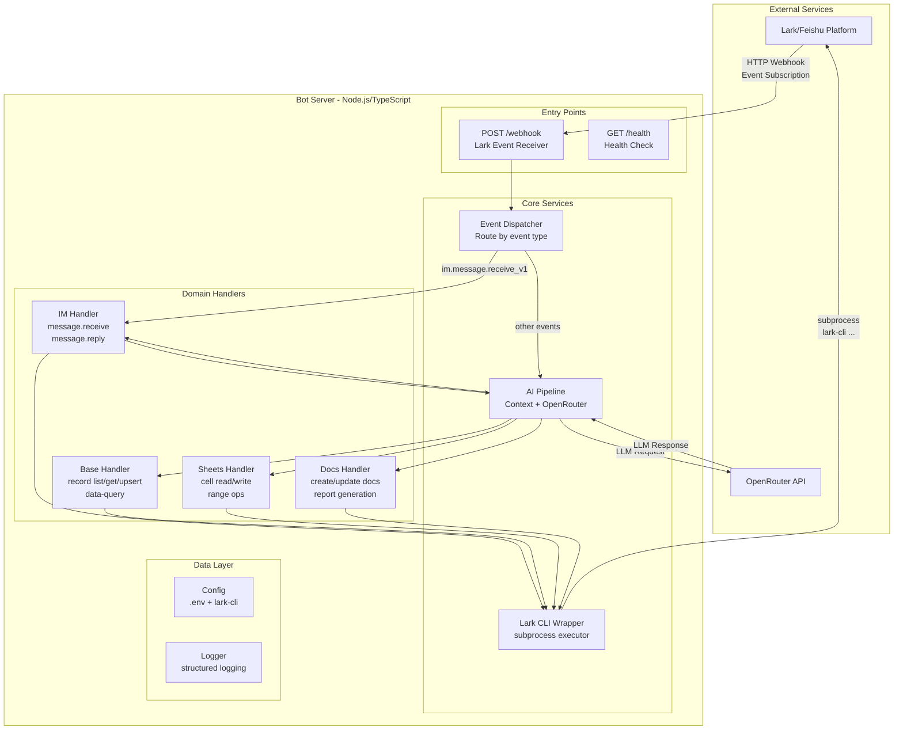
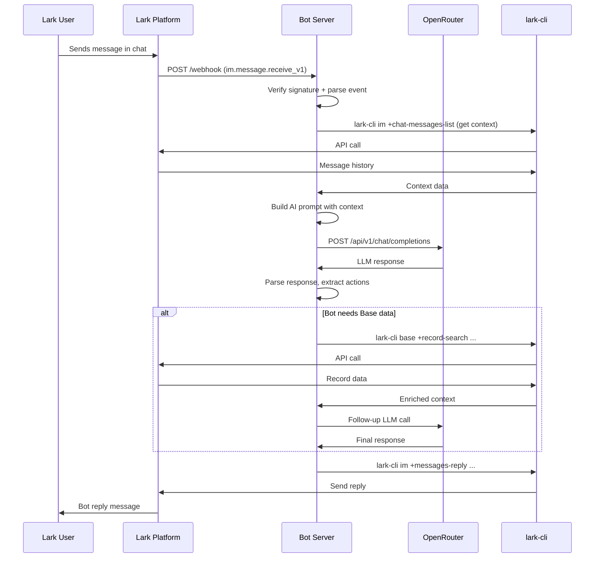
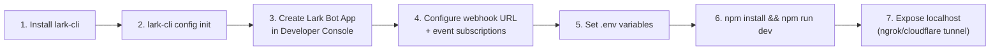

# Lark AI Bot Server — Architecture Plan

## Overview

A Node.js/TypeScript HTTP server that acts as a full-featured Lark bot, using OpenRouter for AI capabilities and `lark-cli` for all Lark data operations (IM messaging, Base, Sheets, Docs).

---

## Architecture Diagram



---

## Data Flow: Chat Message → AI Response



---

## Project Structure

```
aibot/
├── src/
│   ├── index.ts                    # Server entry — Express app bootstrap
│   ├── config.ts                   # Config from env vars (OPENROUTER_API_KEY, LARK_APP_ID, etc.)
│   ├── routes/
│   │   └── webhook.ts              # POST /webhook — receives Lark events
│   ├── services/
│   │   ├── lark-cli.ts             # Lark CLI wrapper — subprocess executor
│   │   ├── openrouter.ts           # OpenRouter HTTP client
│   │   ├── base.ts                 # Lark Base operations (record CRUD, data-query)
│   │   ├── sheets.ts               # Lark Sheets operations (cell read/write)
│   │   ├── docs.ts                 # Lark Docs operations (create, append content)
│   │   └── im.ts                   # IM operations (send, reply, chat history)
│   ├── handlers/
│   │   ├── message.ts              # im.message.receive_v1 handler
│   │   ├── commands.ts             # Bot command parser (/help, /search, /report, etc.)
│   │   └── pipeline.ts             # AI pipeline orchestrator
│   ├── types/
│   │   └── index.ts                # Shared TypeScript interfaces
│   └── utils/
│       └── index.ts                # Logger, signature verification, helpers
├── tests/                          # Unit/integration tests
├── package.json
├── tsconfig.json
├── .env.example
└── README.md
```

---

## Core Components

### 1. Express HTTP Server (`src/index.ts`)

- Starts Express server on configurable port (default 3000)
- `POST /webhook` — Lark event receiver (URL verification + event handling)
- `GET /health` — Health check for monitoring
- Middleware: JSON body parser, request logging, error handler

### 2. Lark CLI Wrapper (`src/services/lark-cli.ts`)

The central bridge to all Lark operations. Executes `lark-cli` as a child process.

**Key methods:**
```typescript
class LarkCLI {
  exec(args: string[], options?: ExecOptions): Promise<CLIResult>;
  execJSON<T>(args: string[]): Promise<T>;  // parse JSON output
}
```

**Operations mapped to CLI commands:**

| Service | Method | CLI Command |
|---------|--------|-------------|
| IM | Send message | `lark-cli im +messages-send --chat-id ... --text "..."` |
| IM | Reply | `lark-cli im +messages-reply --message-id ... --text "..."` |
| IM | Chat history | `lark-cli im +chat-messages-list --chat-id ...` |
| Base | List records | `lark-cli base +record-list --base-token ... --table-id ...` |
| Base | Search records | `lark-cli base +record-search --base-token ... --table-id ... --keyword "..."` |
| Base | Upsert record | `lark-cli base +record-upsert --base-token ... --table-id ... --data '...'` |
| Base | Data query | `lark-cli base +data-query --base-token ... --table-id ... --query '...'` |
| Sheets | Read cells | `lark-cli sheets +range-read --spreadsheet-token ... --range "..."` |
| Sheets | Write cells | `lark-cli sheets +range-write --spreadsheet-token ... --range "..." --data '...'` |
| Docs | Create doc | `lark-cli doc +create --title "..." --content "..."` |
| Docs | Append content | `lark-cli doc +update --token ... --content "..."` |

### 3. OpenRouter Client (`src/services/openrouter.ts`)

HTTP client for OpenRouter API (`https://openrouter.ai/api/v1`).

**Key methods:**
```typescript
class OpenRouter {
  chat(messages: Message[], options?: ChatOptions): Promise<ChatResponse>;
  chatStream(messages: Message[], onChunk: ChunkHandler): Promise<void>;
}
```

**Models:** Configurable via env, default `openai/gpt-4o` or `anthropic/claude-3.5-sonnet`.

### 4. AI Pipeline (`src/handlers/pipeline.ts`)

Orchestrates the full AI response flow:

1. **Receive** message event from webhook
2. **Parse** user intent (command vs. natural language)
3. **Gather context** from Base/Sheets if needed
4. **Build prompt** with system instructions + Lark data context
5. **Call OpenRouter** for LLM response
6. **Execute actions** (write to Base, update Sheets, create Docs)
7. **Send reply** back to user via IM

### 5. Bot Commands (`src/handlers/commands.ts`)

Command parser for structured bot interactions:

| Command | Action |
|---------|--------|
| `/help` | Show available commands |
| `/search <query>` | Search Base records |
| `/report` | Generate Docs report from Base data |
| `/sheet <name>` | Query Sheets data |
| `/ai <prompt>` | Direct AI query with context |

### 6. Event Verification

Lark webhook events must be verified:
- **URL Verification**: Respond with the `challenge` token on app setup
- **Event Signature**: Verify `X-Lark-Request-Timestamp` + `X-Lark-Request-Nonce` + body against `X-Lark-Signature` using HMAC-SHA256

---

## Environment Configuration (`.env`)

```env
# Server
PORT=3000
NODE_ENV=development

# OpenRouter
OPENROUTER_API_KEY=sk-or-v1-...
OPENROUTER_MODEL=openai/gpt-4o

# Lark App (Bot)
LARK_APP_ID=cli_...
LARK_APP_SECRET=...
LARK_VERIFICATION_TOKEN=...

# Lark CLI (installed separately)
# lark-cli config init --new  (run once to set up)

# Lark Resources (optional defaults)
LARK_DEFAULT_BASE_TOKEN=...
LARK_DEFAULT_SHEET_TOKEN=...
```

---

## Dependencies (`package.json`)

```json
{
  "dependencies": {
    "express": "^4.18",
    "dotenv": "^16.3",
    "pino": "^8.17",
    "pino-pretty": "^10.3",
    "zod": "^3.22"
  },
  "devDependencies": {
    "typescript": "^5.3",
    "@types/express": "^4.17",
    "@types/node": "^20.10",
    "tsx": "^4.7",
    "vitest": "^1.2"
  }
}
```

Minimal dependencies — no Lark SDK needed since all Lark operations go through `lark-cli` subprocess.

---

## Setup Flow



---

## Key Design Decisions

| Decision | Rationale |
|----------|-----------|
| **lark-cli as subprocess** (not SDK) | Single tool for all Lark operations; consistent auth; already supports Base/Sheets/Docs/IM via shortcuts |
| **Express.js** (not Fastify) | Simplest HTTP server; sufficient for webhook-only bot |
| **OpenRouter** (not direct provider) | Access to 200+ models; single API key; fallback across providers |
| **No database** | Lark Base/Sheets IS the data store; no sync needed |
| **Stateless server** | Each webhook event is independent; context from Lark chat history + Base |
| **Zod for validation** | Type-safe webhook event parsing and config validation |
